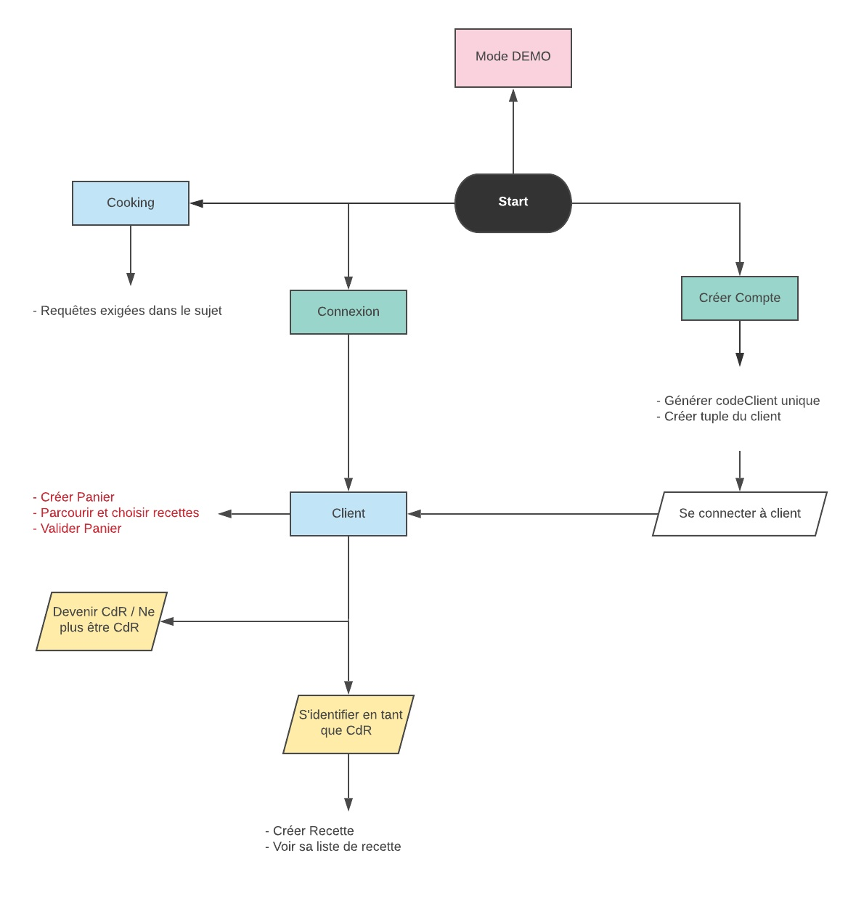
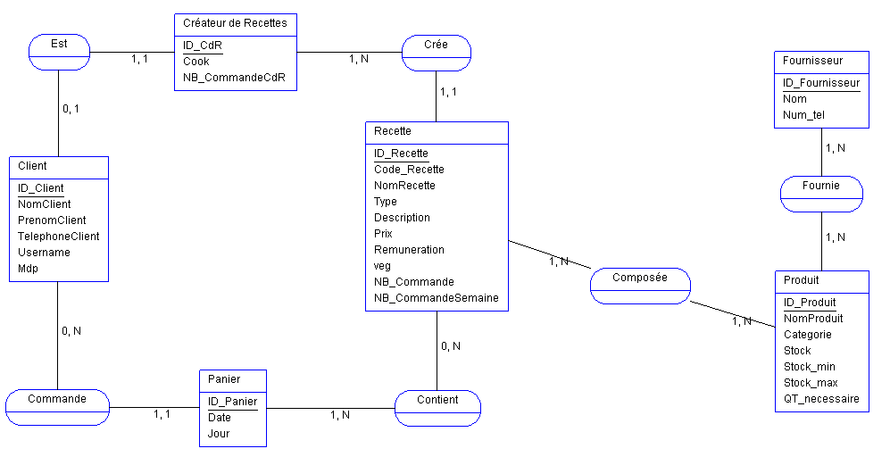

# Sommaire

1. [Présentation](#intro)
2. [Notes techniques](#notes)
    1. [Structure](#structure)
    2. [Database](#db)
3. [Exécution](#exe)

# Présentation startup Cooking 

**Partie "classique" du concept :**

Un site proposant des plats cuisinés. Les clients commandent ces plats par une interface (IHM), puis les plats sont livrés aux clients par un service de livraison.

**Partie "novatrice" : l'échange entre utilisateurs**

Les clients qui commandent les plats sont aussi les cuisiniers qui peuvent proposer les recettes et gagner des points (les **cook**) avec lesquels ils pourront payer leurs achats de repas.

Chaque client peut proposer ses recettes qui pourront être intégrées à la liste des recettes proposées par Cooking (**CdR** = créateur de recette).

## Fonctionnalités du PoC

1. Pour les clients :
* S'identifier ou créer un compte
* Parcourir la liste des recettes proposés
* Choisir un ou plusieurs plats et le payer
* Valider le paiements en *cook*
* Après la saisie d'une commande et son paiement :
    * Le compteur de commande doit s'incrémenter
    * Le prix de vente de la recette augmente de 2 *cook* si son nombre de commande dépasse 10
    * \+ 5 *cook* si elle dépasse 50 & la rémunération du CdR passe à 4 cook.
    * Stocks de produits décrémentés des quantités utilisées pour réaliser les plats commandés par le client

2. Pour les créateurs de recettes (CdR) :
* S'identifier en tant que CdR et accéder à ses fonctionnalités, sinon s'inscrire
* Saisire une recette
    * Saisir les éléments constituant sa recette : *nom*, liste des *ingrédients* avec *quantités*, *description* et *prix de vente* client
* Consulter son solde de cook
* Aperçu de sa liste de recettes avec nombre de commandes

3. Pour le gestionnaire de cooking :
* Tableau de bord de la semaine
    * CdR de la semaine
    * Top 5 recettes
    * CdR ainsi que ses 5 recettes les plus commandés
* Réaprovisionnement hebdomadaire des produits
    * Maj des quantités mmin et max des produits : un produit n'ayant pas été utilisé durant les 30 derniers jours verra ses Qte min et max divisés par 2
    * Edition de la liste des commandes de la semaine au format XML : liste des produits dont la quantité est inférieure à la quantité minimale - quantité commandée égale à la quantité max - classée par fournisseur puis par produit
* Supprimer une recette
* Supprimer un cuisinier et toutes ses recettes (mais il reste client)

# Notes techniques 

## Structure de l'application console 

## Database 

### Diagramme entité-association

### Schéma relationnel

**Unicité** / <u>identifiant</u> / *#clé étrangère*

* Fournisseur (<u>**codeFournisseur**</u>, nomF, telephoneF)
* Produit (<u>**codeProduit**</u>, nomP, catégorie, stock, stockMax, stockMin, unite, dernieUtilisation)
* Recette (<u>**codeRecette**</u>, nomR, type, descriptif, veg, prixR, remuneration, *#codeClient*, nombreCommandeSemaine, nombreCommande)
* Panier (<u>**codeCommande**</u>, date, prixP, *#codeClient*)
* Client (<u>**codeClient**</u>, nomC, prenomC, telephoneC, **usernameC**, mdpC, createur, cook, nombreCommandeCdR)
* Fournie (<u>***#codeFournisseur & #codeProduit***</u>)
* ConstitutionRecette (<u>***#codeRecette & #codeProduit***</u>, quantiteProduit)
* ConstitutionPanier (<u>***#codeCommande & #codeRecette***</u>, quantiteRecette)

# Exécution 

Aucun identifiants n'est à entrer dans le code C# pour se connecter à la base de donnée.
Un utilisateur ayant tous les accès est crée en fin du script MySQL.
Ce sont les identifiants de cet utilisateur qui sont utilisés pour se connecter.

Les deux premières lignes du script MySQL servent à drop la database et supprimer l'utilisateur crée

Voici deux identifiants pour se connecter en tant que client au moment de l'exécution :
* id : Senku | mdp : keurScience (--> ce client est un CdR)
* id : Rick  | mdp : WeAreTheWD  (--> ce client est non CdR)